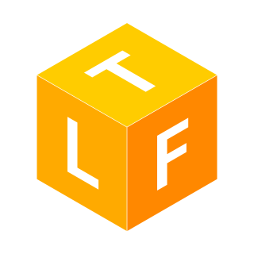

**`Isometry`** is a [Sketch](https://sketchapp.com) plugin that allows to create isometric projections from layers easily.

## Features

The plugin can generate 3 types of isometric projections from your source layers. All kinds of shape layers, as well as text layers are supported.

### Create Top Isometric Projection

### Create Left Isometric Projection

### Create Front Isometric Projection

## Installation

- [Download](https://github.com/maxkonovalov/Isometry/releases/latest/download/Isometry.sketchplugin.zip) the latest release of the plugin
- Un-zip
- Double-click on `Isometry.sketchplugin`

## License

`Isometry` is available under the MIT license. See the LICENSE file for more info.
