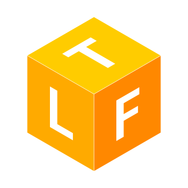

**`Isometry`** is a [Sketch](https://sketchapp.com) plugin that allows to create isometric projections from layers easily.

## Requirements

Sketch **2026.2.1** or later.

## Features

The plugin can generate 3 types of isometric projections from your source layers. All kinds of shape layers, as well as text layers are supported.



### Create Top Isometric Projection


### Create Left Isometric Projection


### Create Front Isometric Projection


## Installation

- [Download](https://github.com/maxkonovalov/Isometry/releases/latest/download/Isometry.sketchplugin.zip) the latest release of the plugin
- Un-zip
- Double-click on `Isometry.sketchplugin`

## Development

```bash
npm install          # builds and symlinks the plugin into Sketch
npm run build        # build once
npm run watch        # rebuild on change
npm test             # end-to-end verification against a real Sketch install
```

`npm test` drives your Sketch install through `sketchtool`: it builds a throwaway
document, runs the plugin's commands against it, reads the resulting path geometry back
out, and compares it to the isometric matrix `R(θ₂)·S(sx,sy)·R(θ₁)`. It covers the three
faces on a rectangle, nested groups with a bezier oval and a text layer, an image that
cannot be projected, and an empty selection.

Note that it closes any open documents, so save your work before running it.

## License

`Isometry` is available under the MIT license. See the LICENSE file for more info.
